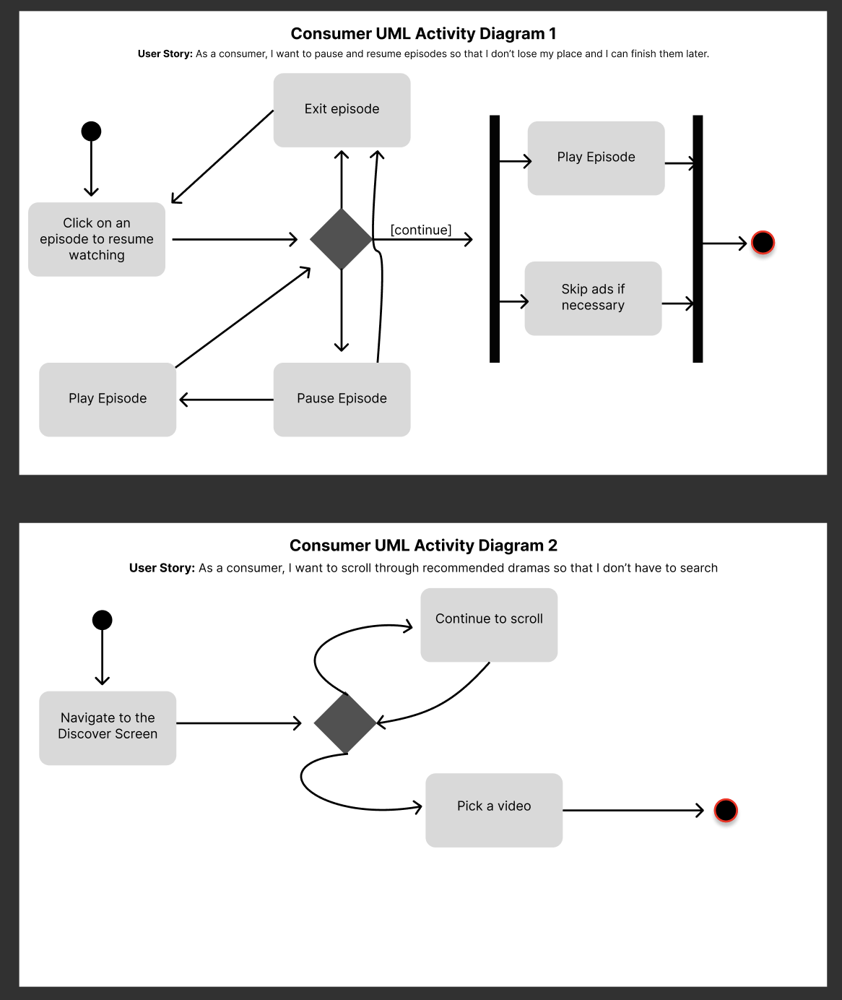
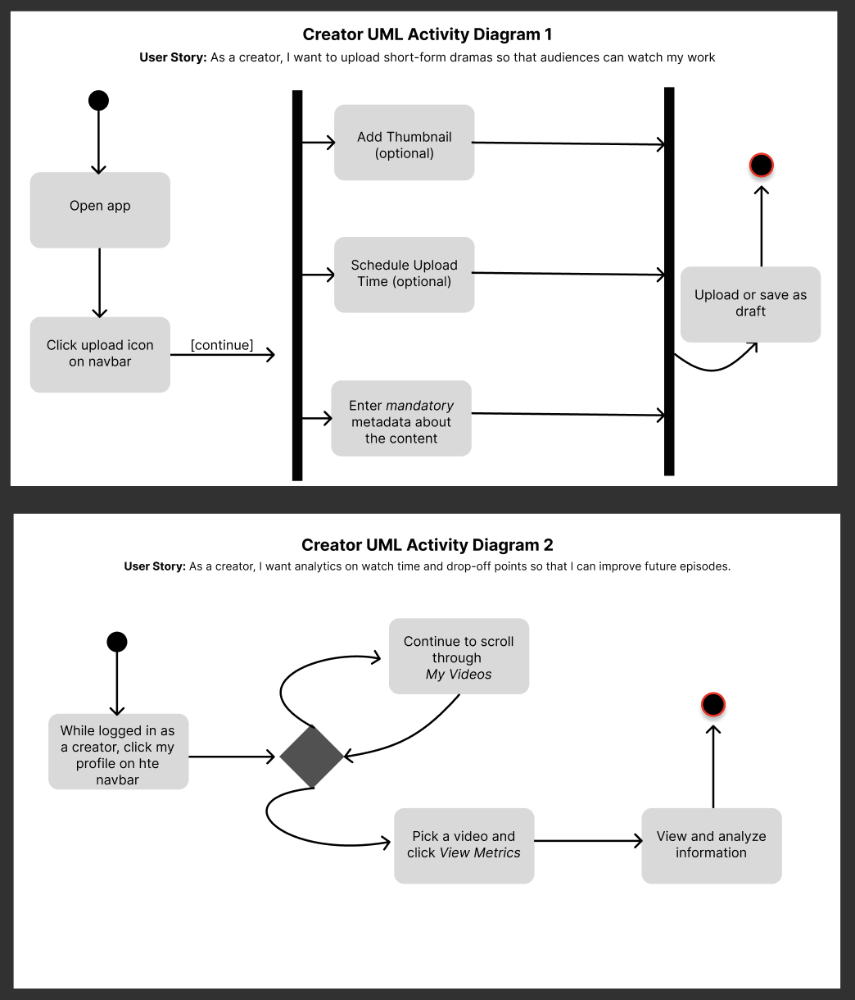

# Specification Phase Exercise

A little exercise to get started with the specification phase of the software development lifecycle. See the [instructions](instructions.md) for more detail.

## Team members
[Adam Soliman](https://github.com/adamsolimancs/)

[Antonio Jackson](https://github.com/antoniojacksnn)

[Bryce Lin](https://github.com/blin03)

## Stakeholders

#### Stakeholder Interview 1 - Primary Users: Consumers (the audience)

I (Adam Soliman) interviewed Clare Dong, a Drexel University student studying entertainment & arts, about our mobile application. She studies a related topic and is a frequent TV and film watcher. Below are the main takeaways from our interview.

**Her 4 needs for our app:**

1. Attention grabbing hooks  
   Being able to feel something emotional / engaging within the first 15-30 seconds of an opening.

2. Low-effort discovery  
   She doesn't really want to search, she'd rather scroll and be shown what interests her. Maybe we should have an introductory page that asks for preferences.

3. Series subscriptions  
   Having the option to watch long chains of related episodes and being hooked like a season of a TV show.

4. High quality / production clips

**Her 4 problems for our app:**

1. Existing platforms feel weak  
   Quality is either too low or feel rushed. Quibi felt this way to Clare.

2. App / Website Accessibility  
   Quibi failed partly because it was only available on the app, and could only be watched horizontally.

3. No feature to follow / subscribe to actors / directors  
   Clare feels like she may want to follow specific creators that she likes, and having that feature is important.

4. Over-monetization  
   Too many ads or forced cliffhangers get frustrating after a while and will deviate users like Clare. She said she doesn't like apps like that and quickly deletes them.

#### Stakeholder Interview 2 - Creators (Content Producers)
I (Antonio Jackson) interviewed Taylor Golden, a digital content creator who produces episodic advice videos across platforms such as TikTok, Instagram Reels, and YouTube Shorts. His content focuses on short, practical advice delivered in series-based formats, where individual videos build on one another over time. Taylor has experience growing an audience through consistent posting and has firsthand experience with the limitations of existing short-form platforms.

**His key needs as a creator:**

1. Support for episodic content

   - Taylor wants a platform where advice videos can be clearly organized into series. He explained that “most apps treat every video like it’s on its own," even when the advice only makes sense as a sequence.

2. Easy ways for audiences to follow creators
   - He emphasized the importance of creator visibility, saying that if someone likes one of his videos, there should be a clear way for them to follow him and find the rest.

3. Retention-focused design
   - Taylor values features that help viewers return to earlier videos. He noted that “advice content works best when people can come back to it later, not just watch once and forget.”

4. Clean and focused presentation
   - He wants his videos to feel professional and distraction-free, stating that the advice should be the focus, not pop-ups or cluttered interfaces. 

5. Sustainable monetization
   - Taylor is interested in earning from his content without sacrificing quality. He said that “I don’t want to change how I give advice just to make ads fit better.”

**His main problems with existing platforms:**

1. Poor organization of advice content
   - Taylor finds it frustrating that there’s no good way to guide people through earlier episodes, so they miss half the context.

2. Weak creator–audience connection
   - Taylor feels disconnected from his audience, saying that “it’s hard to build a relationship when people only see one random clip.”

3. Algorithms prioritize trends over usefulness
   - He explained that “platforms reward whatever’s new or flashy, even if it’s not actually helpful.”

## Product Vision Statement

To be the fastest way for audiences to discover and follow high-quality, short-form dramas, while giving studios a trusted, curated distribution platform built around storytelling, not virality.

## User Requirements

#### Consumers (Audience) – People who watch content on the platform

1. As a consumer, I want to watch short dramas that feel emotionally engaging so that I feel invested
2. As a consumer, I want to pause and resume episodes so that I don’t lose my place
3. As a consumer, I want to scroll through recommended dramas so that I don’t have to search
4. As a consumer, I want the app to show me strong openings first so that I can quickly decide what to watch
5. As a consumer, I want discovery to feel curated so that I don’t feel overwhelmed
6. As a consumer, I want recommendations to improve over time so that the app understands my taste
7. As a consumer, I want high-quality video so that the experience feels premium
8. As a consumer, I want to subscribe/follow a series/creator so that I don’t miss future content
9. As a consumer, I want to save shows/videos for later so that I can return to them
10. As a consumer, I want ads to feel minimal so that they don’t interrupt storytelling
11. As a consumer, I want captions and subtitle language options so that I can follow episodes in different environments
12. As a consumer, I want to download episodes for offline viewing so that I can watch without internet access
13. As a consumer, I want to share a drama or episode link with friends so that I can recommend what I enjoy
14. As a consumer, I want clear content ratings and warnings so that I can decide whether a show fits my preferences

#### Creators – People or teams who upload and manage drama content

1. As a creator, I want to upload short-form dramas so that audiences can watch my work
2. As a creator, I want to edit or update my content so that I can maintain quality
3. As a creator, I want to remove content if needed so that outdated work is not shown
4. As a creator, I want a profile page so that users can follow my work
5. As a creator, I want feedback from audiences so that I can understand what works
6. As a creator, I want to earn revenue from my content so that creating is sustainable.
7. As a creator, I want to organize episodes into series so that stories feel complete.
8. As a creator, I want users to easily discover my other projects so that engagement grows.
9. As a creator, I want the platform to support long-term series so that I can build loyalty.
10. As a creator, I want my content to feel intentionally presented so that it stands out.
11. As a creator, I want analytics on watch time and drop-off points so that I can improve future episodes.
12. As a creator, I want to schedule episode releases ahead of time so that I can maintain a consistent publishing cadence.
13. As a creator, I want to manage episode metadata (titles, tags, thumbnails) so that my content is easier to discover.

## Activity Diagrams

## Clickable Prototype

[Wireframe](https://www.figma.com/design/1opJoQBT4yguU6MudvwKvA/octopus-wireframe?node-id=0-1&p=f&t=GbLbHDdTEk0a9MmH-0)
